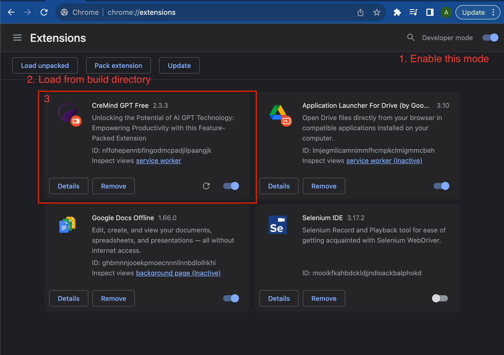

# memoryweb-navigator-extension

![star][star-image]
[![author][author-image]][author-url]
[![license][license-image]][license-url]
[![release][release-image]][release-url]
[![last commit][last-commit-image]][last-commit-url]

[star-image]: https://img.shields.io/github/stars/cremind-ai/cremind-extension.svg
[author-image]: https://img.shields.io/badge/author-lyntcelec-blue.svg
[author-url]: https://github.com/lyntcelec
[release-image]: https://img.shields.io/github/v/release/cremind-ai/cremind-extension?color=blue
[release-url]: https://github.com/cremind-ai/cremind-extension/releases
[license-image]: https://img.shields.io/github/license/cremind-ai/cremind-extension?color=blue
[license-url]: https://github.com/cremind-ai/cremind-extension/blob/master/LICENSE
[last-commit-image]: https://img.shields.io/github/last-commit/cremind-ai/cremind-extension?label=last%20commit
[last-commit-url]: https://github.com/cremind-ai/cremind-extension/commits

<p>
    CreMind <a href="https://cremind.io"></a>
</p>

### Extension Store

<a href="https://chrome.google.com/webstore/detail/cremind-gpt-free/nehpbihbjpnnbacikaminepcfkdioanc?utm_source=github"></a>

<a href="https://www.youtube.com/watch?v=CRt6_K7ZUrs" target="_blank">
 
</a>

##

> A chrome extension tools built with Vite + Vue, and Manifest v3

## Supported providers

- ChatGPT
- Google Bard

## Installing

1. Check if your `Node.js` version is >= **18**.
2. Change or configurate the name of your extension on `src/manifest`.
3. Run `npm install` to install the dependencies.

## Developing

Create dev env

```shell
$ cp sample.env.development .env.development
```

Run the command

```shell
$ cd cremind-extension
$ npm run dev
```

### Chrome Extension Developer Mode

1. set your Chrome browser 'Developer mode' up
2. click 'Load unpacked', and select `cremind-extension/build` folder



## Packing

Create production env (.env.production). After the development of your extension run the command

```shell
$ npm build
```

Now, the content of `build` folder will be the extension ready to be submitted to the Chrome Web Store. Just take a look at the [official guide](https://developer.chrome.com/webstore/publish) to more infos about publishing.
